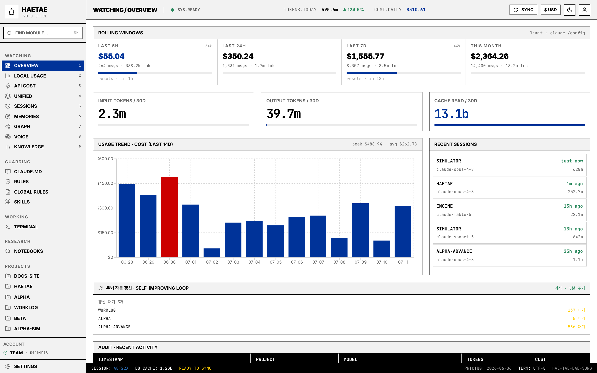
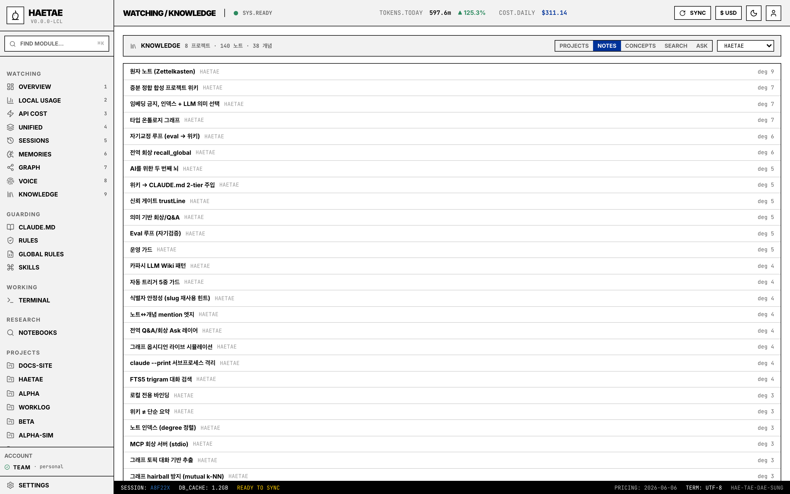
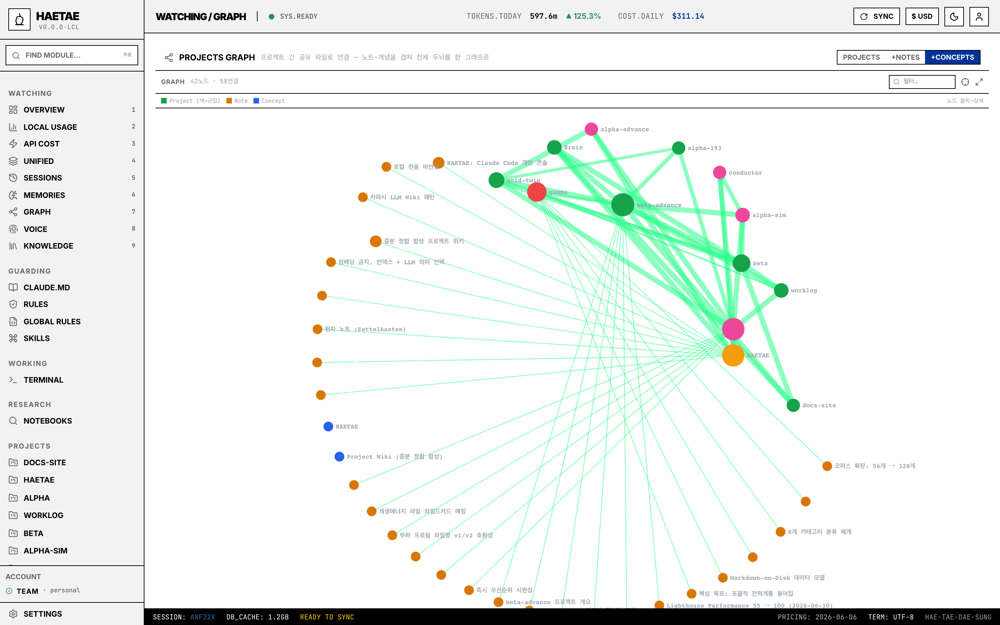
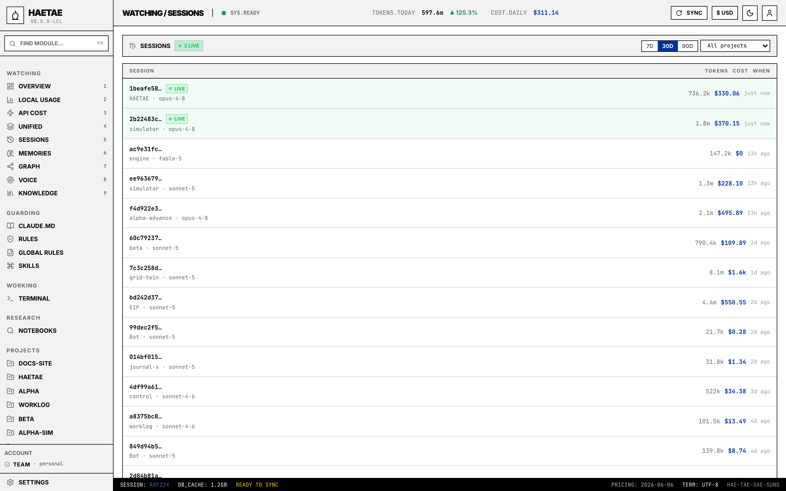

# Haetae (해태)

[한국어](./README.md) | English

A single-user local console for visually managing Claude Code rules / skills and observing token usage. macOS-first.

The single source of truth for spec, roadmap and decisions is [`docs/`](./docs/README.md) (Korean).



## Screenshots

| | |
|---|---|
|  |  |
| **Knowledge** — every project's wiki / notes / concepts in one catalog, full-text conversation search, Ask | **Graph** — the whole brain as an Obsidian-style live graph |

<details>
<summary>Sessions — every project's sessions (LIVE badges · tokens · cost)</summary>


</details>

> Project names in the screenshots are anonymized examples.

## Features

Five axes — each maps 1:1 to a sidebar menu.

**Watching** — usage visibility derived from `~/.claude/projects/*/<sessionId>.jsonl`
- **Overview** — 30-day token / cost / cache trend + Recent Sessions + Audit
- **Local Usage** — daily / per-model / per-project charts + cache-efficiency insights + heatmap (sparkline / top hours / weekday)
- **API Cost** — Anthropic Admin API (Phase 5, only for users who can mint an admin key)
- **Unified** — local jsonl ↔ admin comparison
- **Rolling Windows** — 5h / 24h / 7d / month-to-date 4-cell panel. The 5h / 7d cells show the same real utilization % + reset time as `claude /config` (uses Claude OAuth creds, opt-in only — see *Known limitations*)
- **Export** — entire Local Usage as JSON or CSV (by-day / by-model / by-project)

**Guarding** — Rules / Skills / Global Rules CRUD
- Tree + search + Monaco editor + migration backups
- 3-step wizard (RHF + zod) for creating new skills
- Diff view (Monaco DiffEditor) when a name collides between scopes
- 4-category model from ADR 0007 (rules / skills / agents / commands)

**Working** — integrated terminal
- xterm.js + node-pty + WebSocket
- Multi-tab, right-click context menu, VS Code-compatible shortcuts (`Cmd+T/W/1-9`)
- **Persistent dock** — PTY and scrollback survive route navigation
- Project page's *Continue* button = `claude --continue` auto-typed

**Session drill-down** — message timeline for a single session
- Click a row in Recent Sessions / project page → user/assistant messages with tokens + cost
- Merges in `~/.claude/usage-data/session-meta/<id>.json` (first prompt / git activity / tool distribution)
- Renders 4 part kinds: text / thinking / tool_use / tool_result

**System / Profile**
- Sidebar **ACCOUNT** — subscription tier (Pro / Max), email, org (from `claude auth status`)
- **Settings** — 4-tier cost thresholds (5h / daily / weekly / monthly). Crossing a threshold lights up an `OVER` badge in the sidebar and shows a one-shot toast
- Project root registration (env seed + DB CRUD), auto-memory file viewer

## Getting started on a fresh machine

```bash
git clone https://github.com/kimmjen/HAETAE.git
cd HAETAE
bash scripts/bootstrap.sh
pnpm dev
```

**There are only two hard requirements** — [mise](https://mise.jdx.dev) (`curl https://mise.run | sh`) and bash. `bootstrap.sh` installs the Node + pnpm versions pinned in `.tool-versions` plus the workspace dependencies. Everything else is optional; without it, only that one screen degrades.

### Supported platforms

| OS | Status |
|---|---|
| **macOS** | Primary development platform, covered by CI. Everything, including real usage limits via the Keychain |
| **Linux** | Covered by CI (ubuntu-latest). OAuth creds are read from `~/.claude/.credentials.json` instead of the Keychain (#166) |
| **Windows** | **Unsupported.** The code does branch for it (PTY → `powershell.exe`, creds → file), but `node-pty`'s native build is finicky there, so Windows is absent from the CI matrix and has never been verified. `bootstrap.sh` is bash, so you would need WSL |

### Optional dependencies — and what you lose without them

| Feature | Needs | Without it |
|---|---|---|
| Overview · Local Usage · Guarding · Working | — | Always works (the baseline) |
| Sidebar ACCOUNT (subscription / email) | `claude auth status --json` | Badge hidden |
| Per-project sessions / memory / drill-down | `~/.claude/projects/<encoded>/` data (run `claude` at least once) | Empty lists |
| Rolling Windows real 5h / 7d utilization + reset time | Claude OAuth creds + **opt-in** `HAETAE_USE_OAUTH_LIMITS=true` | Falls back to your thresholds from Settings |
| Second brain (wiki / notes / recall / Q&A) | A logged-in `claude` CLI (invoked as a `claude --print` subprocess — no separate API key) | Brain generation unavailable; the rest is unaffected |
| API Cost / Unified | `ANTHROPIC_ADMIN_KEY` in `apps/server/.env.local` | Those pages render a locked state |
| Research (NotebookLM) | The Python sidecar (`bootstrap.sh` installs its venv + Playwright/chromium) + a Google login via **Settings → NotebookLM** | Research tab degrades |

In other words: **without the `claude` CLI this still works fully as a usage dashboard**; adding the CLI turns on the brain and the real limits.

Detailed setup sequence: [`docs/portability.md`](./docs/portability.md) (Korean).

## Usage (5-minute walkthrough)

1. **Start** — `pnpm dev`, then open `http://127.0.0.1:5173`. On a machine that has used Claude Code, **Overview lights up immediately** (the `~/.claude` JSONL logs are indexed at boot and re-indexed every 30s).
2. **Register projects** — Settings → Project Roots, add your working directories. They appear in the sidebar, and each project page shows its sessions / memory / rules.
3. **Build the brain** — project page → Wiki tab → generate. Conversations are synthesized into a project wiki; atomic notes (Zettelkasten), a typed ontology and note↔concept links are derived from it. The wiki is injected into `.claude/CLAUDE.md`, so **the next Claude Code session starts knowing the history**. With `HAETAE_WIKI_AUTO=true` it refreshes itself as new conversations land (the self-improving loop).
4. **See everything at once** — Knowledge (9): every project's wiki / notes / concepts, full-text conversation search (FTS5), and Ask (cross-project semantic recall, or grounded Q&A against one project). Graph (7): the whole brain as an Obsidian-style live graph — toggle `+Notes` / `+Concepts`, click a node for details.
5. **Watch the spend** — Overview (1) rolling windows (5h/24h/7d/month), Local Usage (2) per-model / per-project breakdowns and cache insights, plus daily/monthly cost-threshold alerts in Settings.
6. **Terminal** — run `claude` right inside the app. A project page's *Continue* button opens the terminal in that project's cwd with `claude --continue` pre-typed.

## Layout

```
haetae/
├── apps/
│   ├── web/         Vite + React (127.0.0.1:5173)
│   └── server/      Fastify     (127.0.0.1:3001)
├── docs/            spec / ADRs / roadmap
├── scripts/
│   ├── bootstrap.sh   1-line setup on a new machine
│   └── launch.sh      dev / prod mode launcher
├── package.json     concurrently runs web + server together
├── pnpm-workspace.yaml
└── .tool-versions
```

## Daily commands

| Command | Purpose |
|---|---|
| `pnpm dev` | Dev mode — web (5173, HMR) + server (3001, tsx watch) in parallel |
| `pnpm build` | Vite build for web (server runs from source via tsx — no build needed) |
| `pnpm start` | Production mode — single-origin: server (3001) hosts the web build too. Run `pnpm build` first |
| `pnpm start:build` | `pnpm build && pnpm start` in one go |
| `bash scripts/launch.sh [--dev\|--prod]` | Same two modes from the shell |
| `pnpm test` | Vitest in both packages |
| `pnpm lint` | `tsc --noEmit` in both packages |
| `pnpm --filter haetae-web <script>` | Run a script directly inside the web package |
| `pnpm --filter haetae-server <script>` | Run a script directly inside the server package |
| `pnpm --filter haetae-server db:generate` | Generate a Drizzle migration |

**Dev mode**: open `http://127.0.0.1:5173` — Vite proxies `/api/*` to the server (3001).

**Prod mode**: open `http://127.0.0.1:3001` — server handles both the web bundle and the API.

### Does it need to stay running?

**Mostly no.** Start it when you want it.

- **Usage** — whatever piled up while the server was down is caught up by the boot indexer the next time you open the app (per-file incremental cursor). Nothing is lost, it is just late.
- **Brain** — the auto-refresh scheduler (`HAETAE_WIKI_AUTO=true`) lives inside the server, so it stops with it. To keep the brain current without a resident server, use the **SessionEnd hook** (`apps/server/scripts/session-end-fold.sh`) — it folds in the background when a Claude Code session ends.

If you do want it resident, register `pnpm start` with your own service manager (launchd/systemd) — **no daemon unit is shipped.** Details: [docs/architecture.md](./docs/architecture.md#백그라운드-루프--무엇이-언제-도는가) (Korean).

## Known limitations

- **Unofficial endpoint — opt-in only** · The "real utilization %" in Rolling Windows directly hits `https://api.anthropic.com/api/oauth/usage`, the same private endpoint Claude CLI uses internally. **Off by default**; you must add `HAETAE_USE_OAUTH_LIMITS=true` to `apps/server/.env.local` and restart the server. If Anthropic changes the schema it breaks silently and falls back to the user-defined thresholds. Background: [`docs/research/claude-code-data-sources.md`](./docs/research/claude-code-data-sources.md) (Korean).
- **OAuth limits source** · The opt-in real-utilization fetch reads Claude's OAuth credentials per-OS — macOS via Keychain (`security` CLI), Linux/Windows via the `~/.claude/.credentials.json` file (`$CLAUDE_CONFIG_DIR` aware) (#166). Absent / logged out → falls back to user thresholds.
- **Hard-coded pricing** · Rates in `services/usage/pricing.ts` are pinned to the 2026-09-06 snapshot. The footer surfaces the `PRICING: <date>` stamp so the staleness is visible; updates land via PRs. Auto-fetch is tracked in [`docs/decisions/pending.md`](./docs/decisions/pending.md).
- **Narrow CI** · GitHub Actions runs `pnpm lint` + `pnpm test` on every PR across ubuntu and macOS runners. But **`pnpm build` and E2E are outside CI** — build verification is manual and there are no browser E2E tests at all (adopting Playwright/Cypress is an open item in [`docs/decisions/pending.md`](./docs/decisions/pending.md)). No Windows runner either (see *Supported platforms*).
- **Single-user, no external exposure** · No auth / multi-user / external hosting story. Assumes a single user on the same machine.

Long-term risks / the Tauri decision: see [`docs/decisions/pending.md`](./docs/decisions/pending.md).

## Security principles (summary)

- Server binds `127.0.0.1` only — other users on the same network cannot reach it
- Secrets like `ANTHROPIC_ADMIN_KEY` live in `apps/server/.env.local` only. Never in the client bundle (`VITE_` prefix forbidden)
- File access under `~/.claude/` is whitelisted

Details: [`docs/architecture.md`](./docs/architecture.md) (Korean).

## License

[MIT](./LICENSE)
