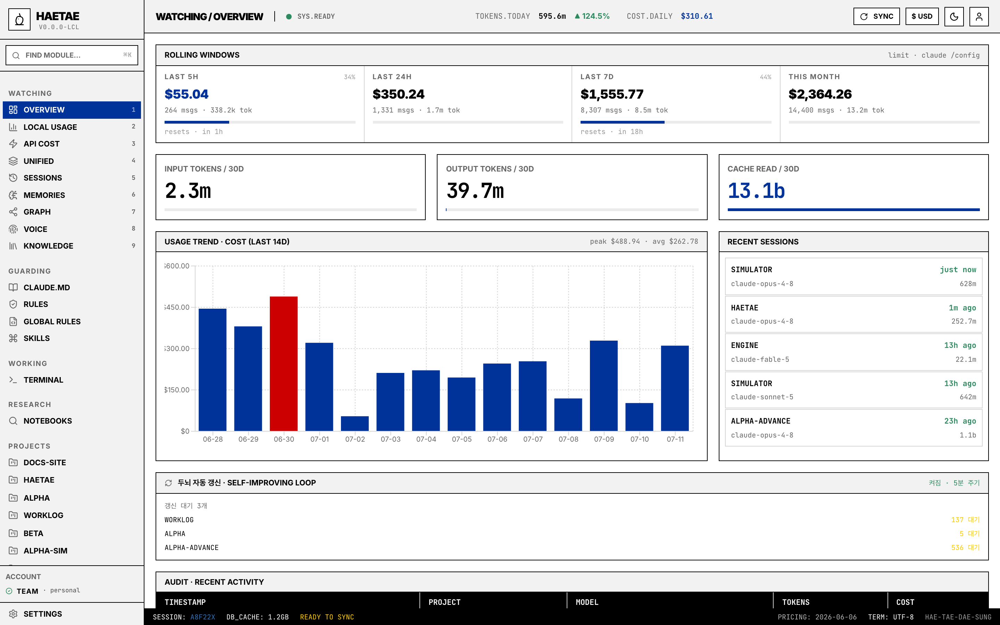
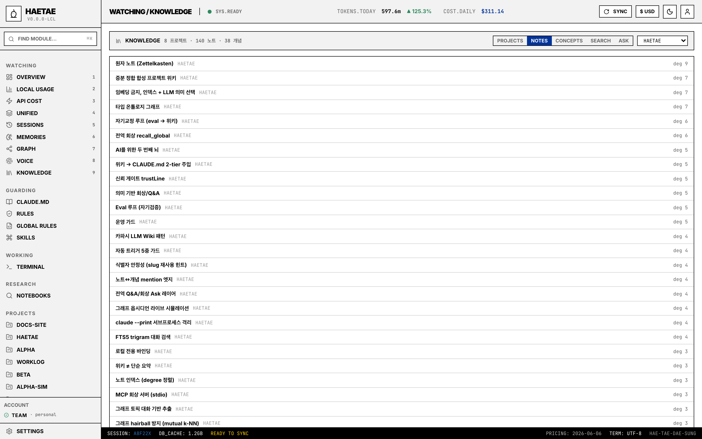
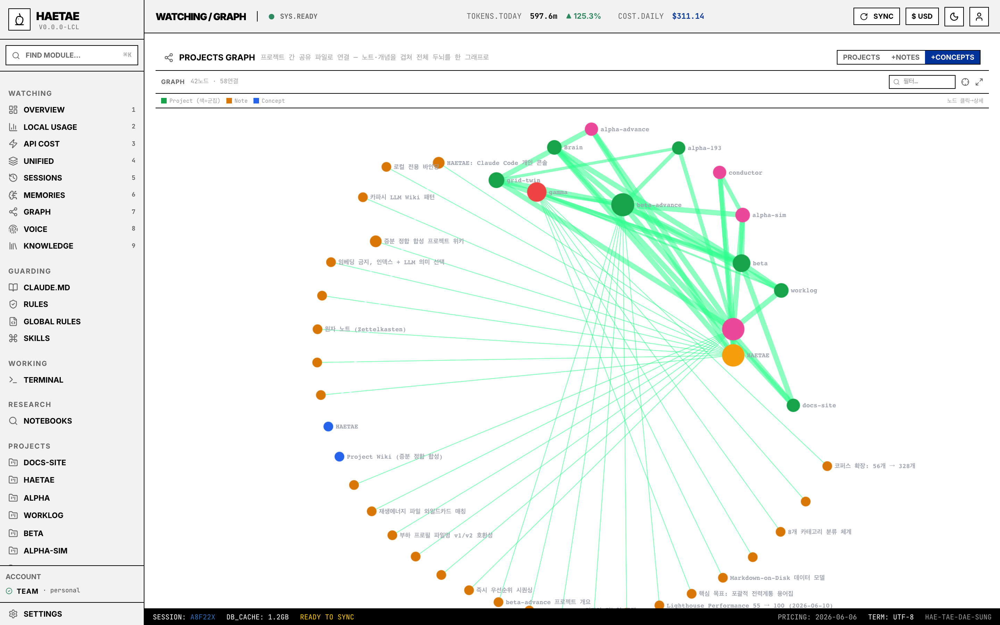
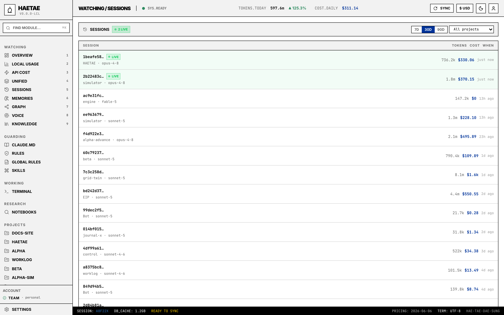

# Haetae (해태)

[한국어](./README.md) | [English](./README.en.md)

Claude Code 의 규칙·스킬을 시각적으로 관리하고 토큰 사용을 분별하는 단일 사용자 로컬 콘솔 (macOS-first).

명세·로드맵·결정 기록은 [`docs/`](./docs/README.md) 가 단일 진실 공급원.



## 스크린샷

| | |
|---|---|
|  |  |
| **Knowledge** — 전 프로젝트 위키·노트·개념 카탈로그 + 대화 전체검색 + Ask | **Graph** — 프로젝트↔노트↔개념을 옵시디언식 라이브 그래프로 |

<details>
<summary>Sessions — 전 프로젝트 세션 목록 (LIVE 배지 · 토큰 · 비용)</summary>


</details>

> 스크린샷의 프로젝트명은 익명화된 예시입니다.

## 기능

5개 축으로 묶음 — 각 항목은 사이드바 한 메뉴에 대응.

**Watching** — `~/.claude/projects/*/<sessionId>.jsonl` 인덱싱 기반 사용량 가시화
- Overview · 30일 토큰 / 비용 / 캐시 추이 + Recent Sessions + Audit
- Local Usage · 일별·모델별·프로젝트별 차트 + 캐시 효율 인사이트 + 히트맵 (sparkline / top hours / weekday)
- API Cost · Anthropic Admin API (Phase 5, key 발급 가능자만)
- Unified · Local jsonl ↔ Admin 비교
- Rolling Windows · 5h / 24h / 7d / 이번 달 4셀 — `claude /config` 와 동일한 진짜 한도 % + reset 시각 (Claude OAuth 자격증명, opt-in — Known limitations 참고)
- Export · Local Usage 전체를 JSON 또는 CSV (by-day / by-model / by-project)

**Guarding** — Rules / Skills / Global Rules CRUD
- 트리 + 검색 + Monaco 편집기 + 마이그레이션 백업
- 3-step 위저드 (RHF + zod) 로 새 스킬 생성
- 동일 이름 충돌 시 diff 비교 (Monaco DiffEditor)
- ADR 0007 의 4-카테고리 (rules / skills / agents / commands)

**Working** — 통합 터미널
- xterm.js + node-pty + WebSocket
- 멀티 탭 + 우클릭 컨텍스트 메뉴 + VS Code 호환 단축키 (`Cmd+T/W/1-9`)
- **Dock 영속**: 다른 페이지로 이동해도 PTY / 스크롤백 살아있음
- 프로젝트 페이지의 Continue 버튼 = `claude --continue` 자동

**Session drill-down** — 한 세션의 메시지 타임라인
- Recent Sessions / 프로젝트 페이지 클릭 → user/assistant 메시지 + 토큰 + 비용
- `~/.claude/usage-data/session-meta/<id>.json` 의 first prompt / git activity / tool 분포 통합
- text / thinking / tool_use / tool_result 4종 part 표시

**System / Profile**
- Sidebar ACCOUNT — 구독 등급 (Pro/Max), email, org (`claude auth status` 기반)
- Settings — 비용 임계치 4-tier (5h / daily / weekly / monthly), 초과 시 OVER 배지 + 1회 토스트
- 프로젝트 등록 (env 시드 + DB CRUD), Auto-memory 파일 viewer

## 새 머신에서 시작

```bash
git clone https://github.com/kimmjen/HAETAE.git
cd HAETAE
bash scripts/bootstrap.sh
pnpm dev
```

`bootstrap.sh` 는 [mise](https://mise.jdx.dev) 가 필요합니다 (`curl https://mise.run | sh`). `.tool-versions` 에 핀된 Node·pnpm 버전을 자동 설치하고 워크스페이스 의존성까지 설치합니다.

### 선택적 의존성

HAETAE 자체는 위 4줄로 동작하지만, **`claude` CLI 가 PATH 에 있을 때만** 활성화되는 기능들이 있습니다:

| 기능 | 의존 |
|---|---|
| 사이드바 ACCOUNT (구독 등급 / email) | `claude auth status --json` |
| Rolling Windows 의 진짜 5h / 7d 한도 % + reset 시각 | Claude OAuth 자격증명 (macOS Keychain / Linux·Windows `~/.claude/.credentials.json`, #166) + **opt-in flag** `HAETAE_USE_OAUTH_LIMITS=true` |
| 프로젝트별 세션 / 메모리 / drill-down | `~/.claude/projects/<encoded>/` 데이터 (claude 한 번 이상 실행 필요) |
| 2차 뇌 (위키 / 노트 / 회상 / Q&A) | `claude --print` 서브프로세스 + Claude 구독 (별도 API 키 불필요) |

CLI 가 없거나 미로그인이면 위 기능들은 graceful 하게 빈 상태를 보이고, 나머지 기능 (Local Usage / Watching / Guarding / Working) 은 정상 동작.

**그 외 선택 연동** (`claude` CLI 와 무관):

- **API Cost / Unified** — `apps/server/.env.local` 의 Anthropic Admin API 키(`ANTHROPIC_ADMIN_KEY`). 없으면 해당 페이지는 잠금 상태.
- **NotebookLM (Research 탭)** — Python 사이드카(`apps/notebooklm`; `bootstrap.sh` 가 venv + Playwright/chromium 설치). 최초엔 **Settings → NotebookLM** 에서 재인증(브라우저 구글 로그인). 없으면 Research 탭 degrade.

상세 setup 시퀀스는 [docs/portability.md](./docs/portability.md).

## 사용법 (5분 워크스루)

1. **시작** — `pnpm dev` 후 `http://127.0.0.1:5173`. Claude Code 를 써 온 머신이면 **Overview 에 사용량이 바로 뜬다** (`~/.claude` 의 JSONL 을 부팅 시 자동 인덱싱, 30초 주기 갱신).
2. **프로젝트 등록** — Settings → 프로젝트 루트에 작업 디렉터리 추가. 사이드바 PROJECTS 에 나타나고, 프로젝트 페이지에서 세션·메모리·rules 를 프로젝트 단위로 본다.
3. **두뇌 만들기** — 프로젝트 페이지 → Wiki 탭 → 생성. 대화 기록이 프로젝트 위키로 합성되고, 노트(제텔카스텐)·온톨로지·노트↔개념 링크가 파생된다. 위키는 `.claude/CLAUDE.md` 에 주입돼 **다음 Claude Code 세션이 히스토리를 알고 시작**한다. `HAETAE_WIKI_AUTO=true` 면 새 대화가 쌓일 때마다 자동 갱신(자기개선 루프).
4. **한눈에 보기** — Knowledge(9): 전 프로젝트 위키·노트·개념 카탈로그 + 대화 전체검색(FTS5) + Ask(전역 의미 회상 / 프로젝트에 질문). Graph(7): 전체 두뇌를 옵시디언식 그래프로 — `+Notes` / `+Concepts` 토글, 노드 클릭 → 상세.
5. **비용 감시** — Overview(1) 롤링 윈도우(5h/24h/7d/월), Local Usage(2) 모델·프로젝트별 분해와 캐시 인사이트, Settings 에서 일/월 비용 임계치 알림.
6. **터미널** — Terminal 에서 `claude` 를 바로. 프로젝트 페이지의 *Continue* 버튼은 그 프로젝트 cwd 로 터미널을 열고 `claude --continue` 를 자동 입력한다.

## 레이아웃

```
haetae/
├── apps/
│   ├── web/         Vite + React (127.0.0.1:5173)
│   └── server/      Fastify     (127.0.0.1:3001)
├── docs/            명세 / ADR / 로드맵
├── scripts/
│   ├── bootstrap.sh   새 머신 1줄 setup
│   └── launch.sh      dev / prod 모드 launcher
├── package.json     concurrently 로 web + server 동시 실행
├── pnpm-workspace.yaml
└── .tool-versions
```

## 일상 명령

| 명령 | 설명 |
|---|---|
| `pnpm dev` | 개발 모드 — web (5173, HMR) + server (3001, tsx watch) 동시 |
| `pnpm build` | web vite build (server 는 tsx 로 직접 실행하므로 빌드 불필요) |
| `pnpm start` | 프로덕션 모드 — server (3001) 가 web 빌드 산출물도 같이 서빙 (단일 origin). `pnpm build` 후 실행 |
| `pnpm start:build` | `pnpm build && pnpm start` 한 번에 |
| `bash scripts/launch.sh [--dev\|--prod]` | 위 두 모드 셸에서 한 줄 |
| `pnpm test` | 양 패키지 Vitest 실행 |
| `pnpm lint` | 두 패키지 `tsc --noEmit` |
| `pnpm --filter haetae-web <script>` | web 패키지에서 직접 실행 |
| `pnpm --filter haetae-server <script>` | server 패키지에서 직접 실행 |
| `pnpm --filter haetae-server db:generate` | Drizzle 마이그레이션 생성 |

**Dev 모드 접속**: `http://127.0.0.1:5173` — Vite 가 `/api/*` 를 server (3001) 로 프록시.

**Prod 모드 접속**: `http://127.0.0.1:3001` — server 가 web 빌드 + API 모두 처리 (단일 포트).

## 알려진 한계

- **비공식 endpoint — opt-in only** · Rolling Windows 의 \"진짜 한도 %\" 는 Claude CLI 가 내부적으로 쓰는 `https://api.anthropic.com/api/oauth/usage` 를 직접 호출. **기본 비활성**, `apps/server/.env.local` 에 `HAETAE_USE_OAUTH_LIMITS=true` 명시 후 서버 재시작해야 켜짐. Anthropic 이 schema 바꾸면 무음으로 깨지고 자동으로 사용자 임계치 fallback. 자세한 근거: [`docs/research/claude-code-data-sources.md`](./docs/research/claude-code-data-sources.md).
- **OAuth 한도 소스** · opt-in 진짜 한도 fetch 는 Claude OAuth 자격증명을 OS별로 읽음 — macOS 는 Keychain (`security` CLI), Linux/Windows 는 `~/.claude/.credentials.json` 파일(`$CLAUDE_CONFIG_DIR` 인식) (#166). 없거나 미로그인이면 사용자 임계치 (#141 / #153) 로 fallback.
- **가격표 hard-coded** · `services/usage/pricing.ts` 의 단가는 2026-05-03 기준 박제. footer 의 `PRICING: <date>` 가 현재 기준 stamp 로 노출되며, 변동 시 PR 로 직접 갱신해야 함. 자동 fetch 는 [`docs/decisions/pending.md`](./docs/decisions/pending.md) 의 미정 항목.
- **CI / 자동화 0** · 현재 `pnpm lint && pnpm test` 는 사용자 한 명의 규율로 돌아가는 중. PR 머지 전 GitHub Actions 같은 게이트 없음.
- **단일 사용자 / 외부 노출 미고려** · 인증 / 멀티유저 / 외부 host 일체 안 다룸. 같은 머신의 단일 사용자만 가정.

장기 위험 / Tauri 결정 등은 [`docs/decisions/pending.md`](./docs/decisions/pending.md).

## 보안 원칙 (요약)

- 서버는 `127.0.0.1` 만 바인딩 — 같은 네트워크 다른 사용자 접근 불가
- `ANTHROPIC_ADMIN_KEY` 등 비밀은 `apps/server/.env.local` 에만. 클라이언트 번들 절대 미포함 (`VITE_` prefix 금지)
- 사용자 데이터 (`~/.claude/`) 접근은 화이트리스트 경로만

상세는 [docs/architecture.md](./docs/architecture.md).

## 라이선스

[MIT](./LICENSE)
